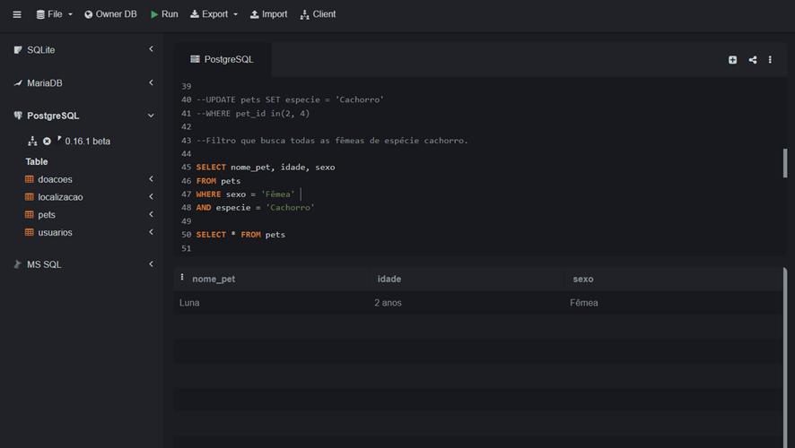
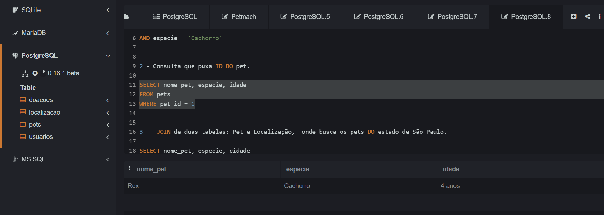
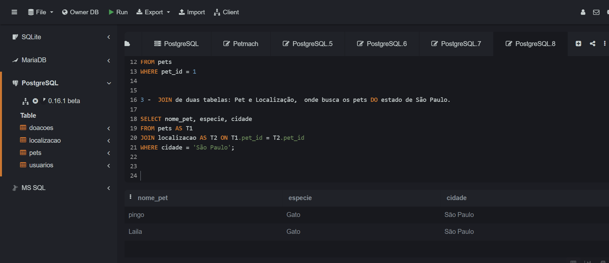
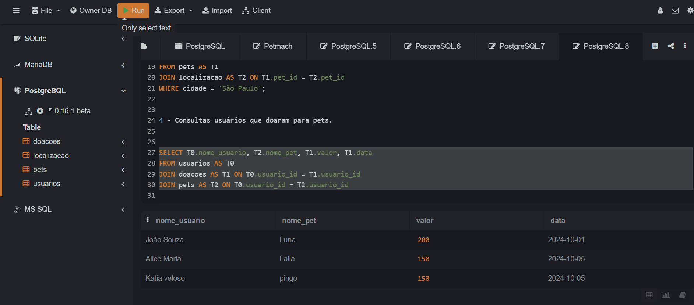
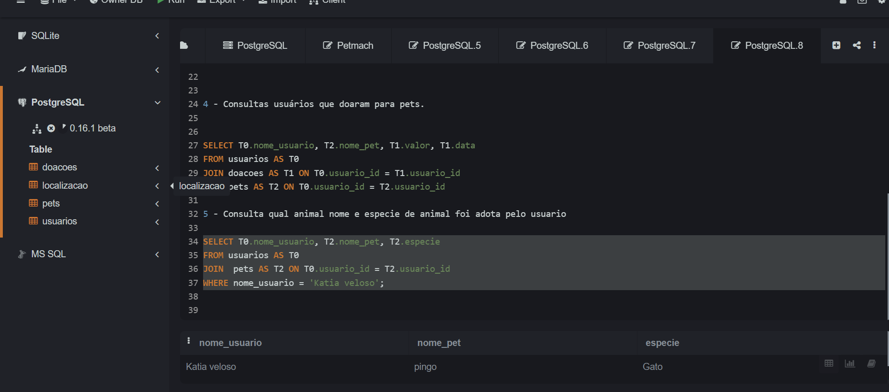
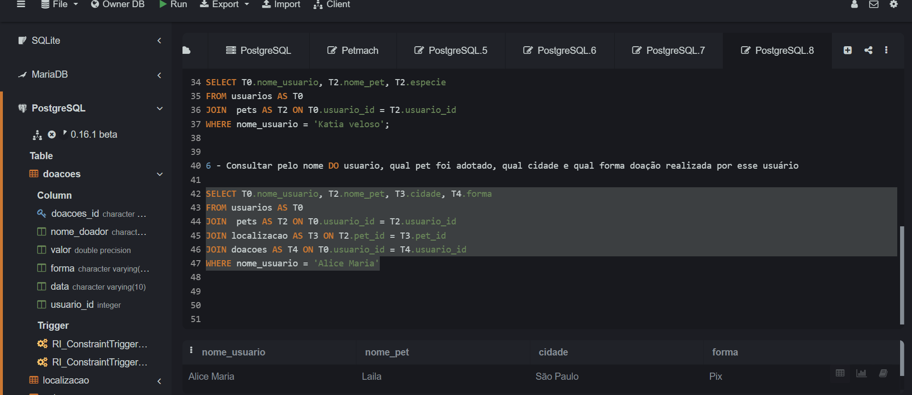

## Realizar consultas simples, se possível, juntando tabelas.
Desenvolvimento

1 - Select  que busca todas as fêmeas de espécie cachorro. 

```sql
SELECT nome_pet, idade, sexo
FROM pets
WHERE sexo = 'Fêmea' 
AND especie = 'Cachorro'

```



2 - Consulta realizado pelo numero do ID do pet para buscar nome, especie, idade 

```sql
select nome_pet, especie, idade
from pets
where pet_id =1
```



3 - Join de duas tabelas: Pet e Localização,  onde busca os pets do estado de São Paulo.

```sql
SELECT nome_pet, especie, cidade
FROM pets AS T1
JOIN localizacao AS T2 ON T1.pet_id = T2.pet_id
WHERE cidade = 'São Paulo';

```




3 - Consultar usuários que doaram para pets.

```sql
SELECT T0.nome_usuario, T2.nome_pet, T1.valor, T1.data
FROM usuarios AS T0
JOIN doacoes AS T1 ON T0.usuario_id = T1.usuario_id
JOIN pets AS T2 ON T0.usuario_id = T2.usuario_id

```



5 - Consulta qual animal nome e especie de animal foi adota pelo usuario

```sql
select T0.nome_usuario, T2.nome_pet, T2.especie
from usuarios as T0
join  pets AS T2 ON T0.usuario_id = T2.usuario_id
where nome_usuario = 'Katia veloso';

```




6 - Consultar pelo nome do usuario, qual pet foi adotado, qual cidade e qual forma doação realizada por esse usuário

```sql
select T0.nome_usuario, T2.nome_pet, T3.cidade, T4.forma
from usuarios as T0
join  pets AS T2 ON T0.usuario_id = T2.usuario_id
join localizacao as T3 on T2.pet_id = T3.pet_id
JOIN doacoes as T4 on T0.usuario_id = T4.usuario_id
where nome_usuario = 'Alice Maria'

```



